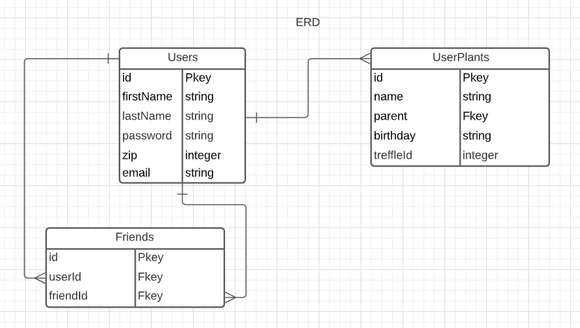

# Florista
By Minh Trinh | November 17, 2020

Contact
[LinkedIn](https://www.linkedin.com/in/m-trinh/) | [Github](https://github.com/mtrinh11)

## Description

With Florista you will be able to track your plants. It will tell you how to best take care of your plant and take into consideration the weather around you. 

## User Stories

- User will be able to create an account
- User will be able to track their plant babies
- User will be offered ways to take care of their plants based on the weather of their climate
- User will be able to add friends

## Technologies Used

* Postgresql
* Sequelize
* Express
* React 
* Redux
* Node

## ERD

## Post MVP
- set up a forum for each plant
- set up live messaging between friends
- data storage and api call optimization
- add resources page
- add profile picture option
- add plant identifier by photo
- add pagination for search results

## Credits
- tab icon - https://www.flaticon.com/
- live weather api - https://openweathermap.org/
- weather icons mapping - https://gist.github.com/tbranyen/62d974681dea8ee0caa1
- weater icons - https://erikflowers.github.io/weather-icons/ 
- converting Unix Timestamps to time -  https://stackoverflow.com/questions/847185/convert-a-unix-timestamp-to-time-in-javascript
- images - https://unsplash.com/
- plant data api - https://trefle.io/
- ui components - https://material-ui.com/
